# ESP32 Hub75 ADAPTER
目前大量的LED点阵屏均为Hub75接口如下图所示，想要驱动它的话需要占用13个IO引脚。而有的点阵比较多的LED屏则更是需要使用到14个引脚，即右排第四个针脚的GND改变为信号通道E，如图二所示。在做各种LED点阵屏相关实验时，如果使用杜邦线来连接这些针脚的话估计会让你眼花缭乱，接错或者没有接稳时更会让人头疼。所以就萌生了做一个针对ESP32开发板的适配器的念头。
在Github上找到一个针对ESP32 DevKitC V1的[项目](https://github.com/rorosaurus/esp32-hub75-driver)，不过现在市面上绝大部分ESP32开发板均已经升级到ESP32 DevKitC V4。V4相比V1来说多了8个IO引脚。所以，就参考该项目自己从头学习PCB画板，制作了这个针对ESP32 DevKitC V4的 Hub75 Adapter。

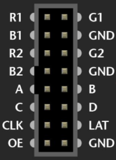  
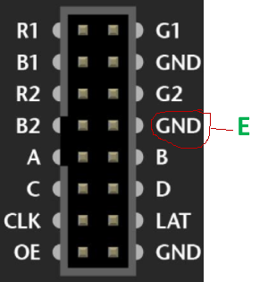

# 制作
其实在动手做之前，我也没想到随着技术的发展，各种各样的在线服务都已经如此的完善。我基本上使用了立创的一条龙服务。
- PCB画图：[LCEDA](https://lceda.cn/)，国外用户则可对应使用 [EasyEDA](https://easyeda.com/)。可以在线直接画原理图，绘制PCB板等。所有的步骤基本都可以在线直接完成（自动布线部分还是需要下载一个客户端工具，当然，自动布线还是有点瑕疵这就是后话了）。像我这种完全没有基础的小白，简单学学就能够上手了。
- 元器件采购：[立创商城](https://www.szlcsc.com/)
- PCB定制：[嘉立创](https://www.jlc.com/)，每月有两次5元制板的机会，这5块钱包含5个样板以及运费，几乎等于白嫖。

制作出来的PCB板成品如下图所示： 
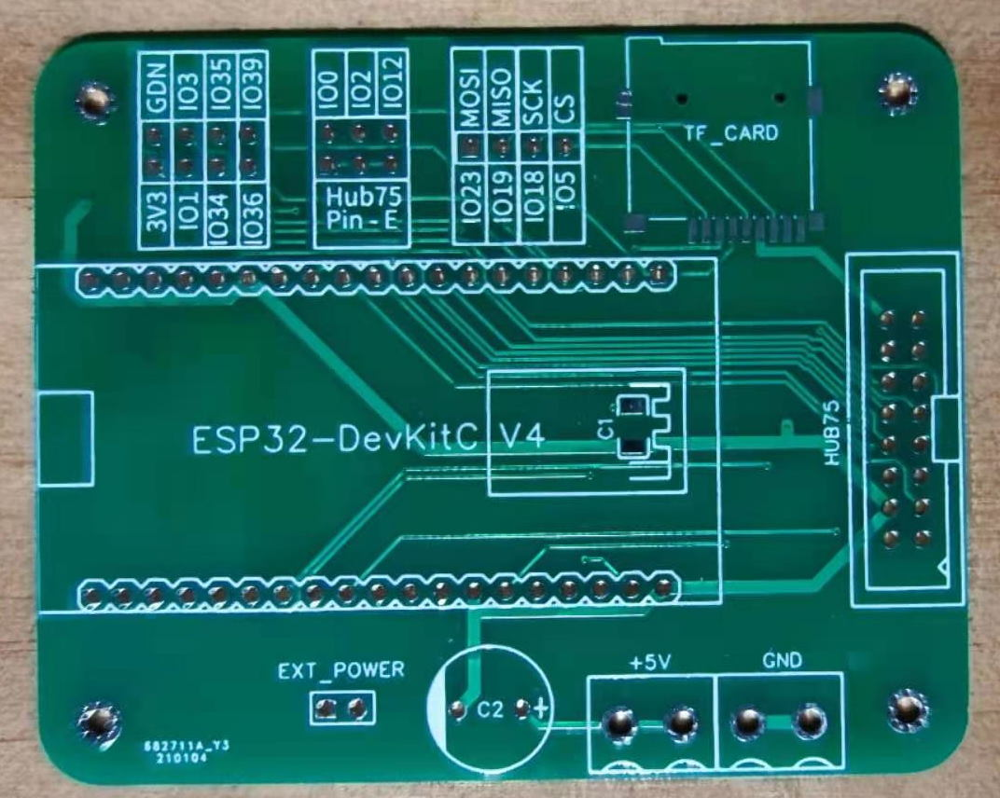
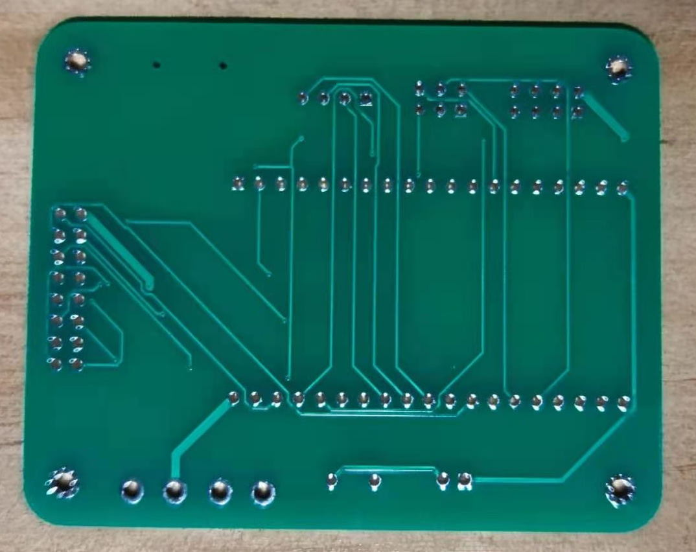

# 特点
在制作这个Hub75适配板的过程中，充分考虑到未来的使用场景和实际遇到过的问题，使得它具有以下特点：
- **方便插拔**：板子上按照ESP32 DevKitC V4的IO引脚预留焊盘，只需要焊接2排19针排母，将ESP32开发板直接插在排母上。Hub75连接端根据实际需求焊盘上可以焊接简易2X8 IDC连接器通过排线直接连接到点阵模块上，或者通过2X8的的排母直接扣到点阵模块后方,从而避免以前十几条线到处乱飞的状况。如下方两图所示。 
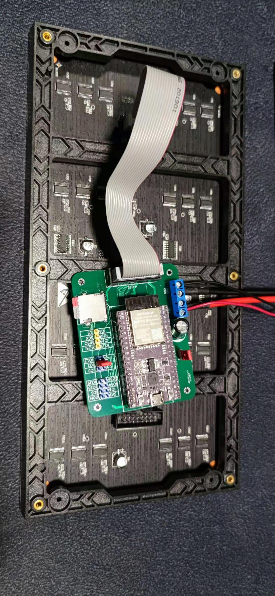 
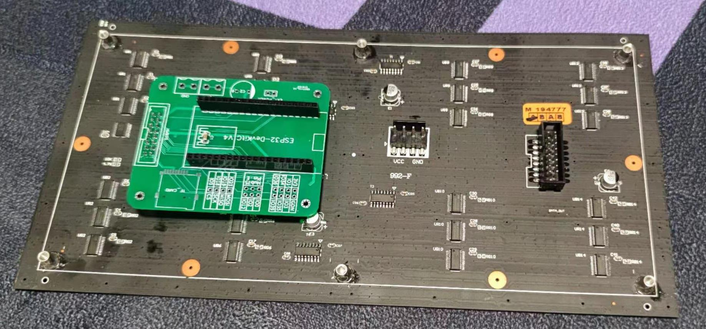
- **自带TF卡模块**：PCB板上预留TF卡卡槽的焊盘，如果你希望用TF卡来存储各种需要显示的图片，那么它就用的上了，同时也将SPI接口引出针脚，如需其他SPI器件要用也能方便的来连接。 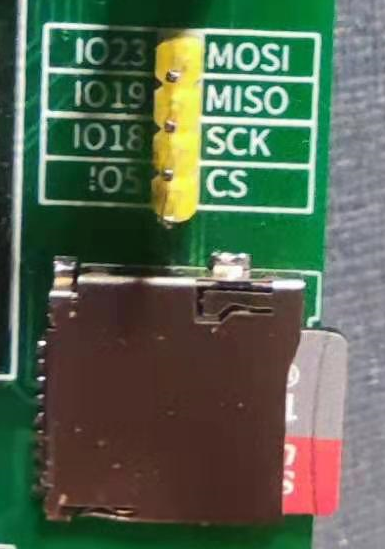
- **兼容Hub75E**: 引出Hub75E所需要的E针脚，根据你的实际情况可选择使用跳线帽将其配置为IO0/IO2/IO12中的一个。 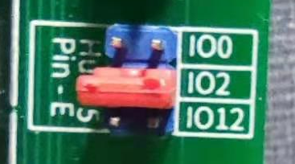
- **额外的IO引出**: 引出了3.3V和GND，以及IO1/IO3/IO34/IO35/IO36/IO39便于扩展使用。 
- **支持外接电源**: 在实际的使用过程中，或许供电来源并没有micro USB可以直接连接到开发板的USB接口上，那么可以用5V电源线直接通过接线柱进行供电，为了防止误操作这里也布置了一个跳线帽来让你可选的启用外接电源。同时参考[这篇内容](https://github.com/rorosaurus/esp32-hub75-driver/blob/master/POWER.md)，预留了电容位置用于防止外接电源的突发电流造成的器件损坏。 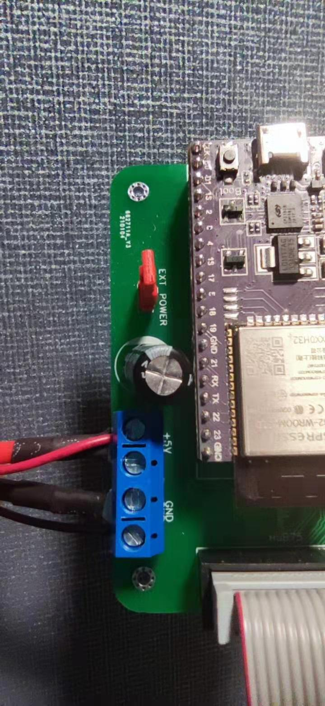
- **解决ESP32开发板部署时可能的超时错误**：根据[这里](https://randomnerdtutorials.com/solved-failed-to-connect-to-esp32-timed-out-waiting-for-packet-header/)和[此项目](https://github.com/rorosaurus/esp32-hub75-driver)介绍，加入可选的10uF电容在EN和GND上。 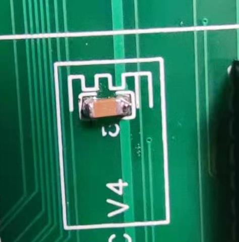
- **带4个M2定位孔**：便于安装固定。

# 使用方式
- 最精简模式下可以只焊接2组19针排母，和根据实际需要加上2X8的IDC排线连接器或者简单在底部焊接一组2X8的排母即可。
- 也可以根据实际情况将其他部件都加上。

# 源代码
- 项目的原理图参见 [src/Schematic](src/Schematic) 目录，如需做二次修改可以简单的导入到LCEDA或者EasyEDA里。
- 在 [src/Gerber](src/Gerber) 下有 Gerber 制板文件，可以方便的提交到你惯用的制板厂家来制板。当然，这里我还是推荐嘉立创的服务，毕竟每个月都有2次5块钱的特价板机会，不用白不用。

# 测试
测试代码见 test 目录下源代码，为PlatformIO工程。根据您的实际LED点阵屏情况来配置 platformio.ini中的屏幕高宽即可。
测试代码主要使用了[ESP32 HUB75 MatrixPanel I2S DMA](https://github.com/mrfaptastic/ESP32-HUB75-MatrixPanel-I2S-DMA)这个库。 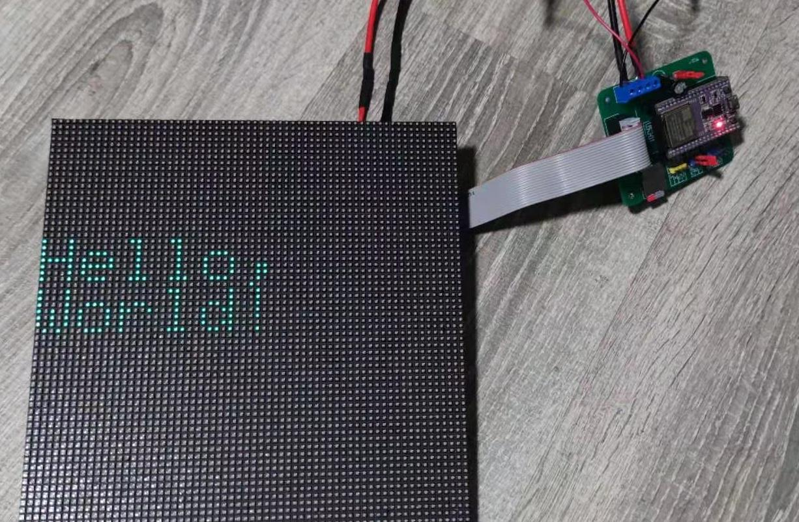